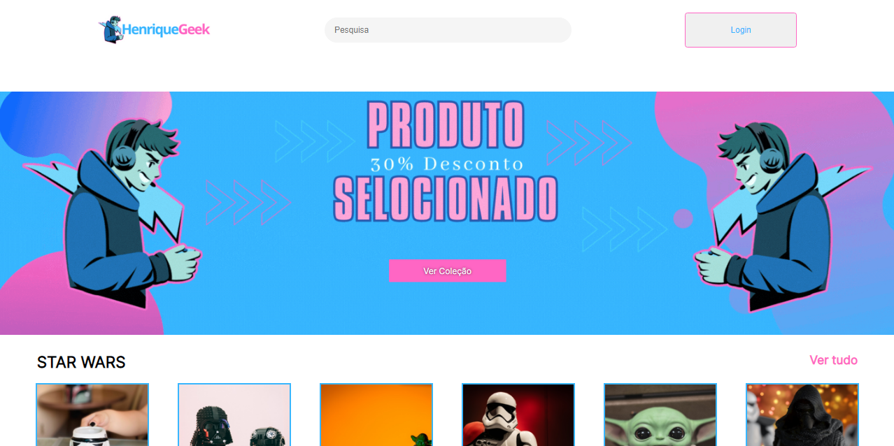

<h1> Challenge ONE | Front End - AluraGeek </h1>

## :clipboard: Sobre o Projeto

Esse Projeto foi promovido pela Alura + Oracle ONE na formação Front-End, com o objetivo de praticar lógica de programação com JavaScript, o desafio proposto foi a criação de um e-commerce. 

Todo layout foi disponibilizado no Figma e para organização ágil de desenvolvimento foi utilizado o Trello.

### :wrench: Fake API JSON-Server.

Usamos o JSON server simulando uma API, para criação de um `CRUD / Create, Read, Update e Delete` no passo 3 de como iniciar esse projeto descreve como subir a API.
Para mais detalhes acesse: https://www.npmjs.com/package/json-server

### :wrench: npm install -g BROwSER.

USE COMANDO
 
browser-sync start --server --file . --host --port 5000 --starPath admin/lista\_\_produto.html

### :warning: Como iniciar esse projeto.

Se preferir nao ter que baixar tudo, basta baixar o arquivo `db.json`

- Dentro da pasta onde salvar esse arquivo, execute o Passo 3 para rodar o servidor e acesse o link do projeto no pages... https://github.com/Henrique-Ramos29/HenriqueGeek.git

OU siga os Passos a seguir :arrow_down:

#### Passo 1 - Clonar o projeto (baixar para sua maquina) Via HTTPS ou SSH

HTTPS `git clone https://github.com/Henrique-Ramos29/HenriqueGeek.git
 
 SSH `git clone git@github.com:Henrique-Ramos29/HenriqueGeek.git

#### Passo 2 - Instalar o NodeJS

Para mais detalhes acesse: https://nodejs.org/pt-br

#### Passo 3 - Subir a fake API

No terminal dentro da pasta do projeto, deve ser executado o comando `json-server --watch db.json`  
LEMBRANDO, que caso execute o comando fora da pasta do projeto ele não vai ser reconhecido.

#### Passo 4 - Abrir o sistema

Utilize a extensão do Live Server do VS Code para abrir o sistema.
Para mais detalhes acesse: https://marketplace.visualstudio.com/items?itemName=ritwickdey.LiveServer

## :computer: Tecnologias utilizadas

- HTML
- CSS
- JavaScript
- JSON-server
